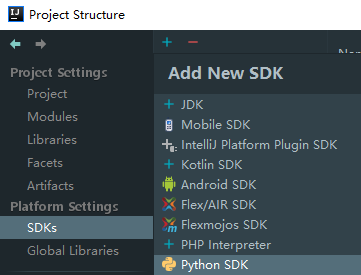
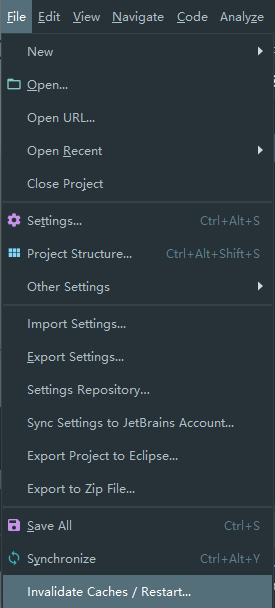

（以下是小学生日记式开头）

今天我们来讨论一下在Windows上使用pwntools的新姿势。

好吧其实也不算新，WSL到现在也有一段时间了，PyCharm支持它也挺久了，下面就来简单介绍一下怎么玩耍——

## 如果你不打算用IDE...
那似乎并不需要看我下面在废话什么了...你只需要：

1、在**控制面板->程序->启用或关闭Windows功能**里选上**适用于Linux的Windows子系统**，或是直接：

    Enable-WindowsOptionalFeature -Online -FeatureName Microsoft-Windows-Subsystem-Linux

2、可以到**Microsoft Store**搜索WSL，然后下载安装一个适合你的Linux发行版。

3、在WSL中安装你所需要的工具，例如python、nano，当然还有pwntools。

然后你就可以愉快地开始撸题了。

## 准备好WSL和IDE
好了我们来进入正题。这里我就假设你已经根据上面的几句简短的描述安装好了WSL（滑稽.jpg）。现在，你可以选择[JetBrains PyCharm](https://www.jetbrains.com/pycharm/)，对于学生来说，可以申请教育授权来免费使用Professional版本。

另外，如果你已经拥有了JetBrains IntelliJ IDEA Ultimate，并且不希望再安装一个IDE，你可以安装Python插件来实现。

## 配置一下
### 对于IDEA
如果你不想看我扯皮，你可以出门拐弯到[这里](https://www.jetbrains.com/help/idea/configuring-remote-python-sdks.html)，但是要是遇到了问题，你可能需要回来一趟，说不定有你需要的答案。

好了，我假装你已经新建好了一个Project，这个时候你可以在右上角或**Settings**中找到**Project Structure (Ctrl+Alt+Shift+S)**，然后选中左侧栏的**Platform Settings->SDKs**，点击加号并选中**Python SDK**，就像这样：

比较难受的是，在2018.3还是有**WSL**选项的，升级到2019.1（插件也更新了）却没有了，还没有去查具体原因，希望这是暂时的。不过我们可以先使用**SSH Interpreter**一下。

这个时候你应该保证WSL上已经开启了SSH服务：

如果没有，你应当检查：是否已经安装了例如openssh-server、是否没有启动服务

    sudo service ssh start

、或是配置文件存在问题

    sudo nano /etc/ssh/sshd_config

？我觉得你可以通过搜索引擎来解决这些问题。

这些都准备就绪了你就可以将这些信息填入刚刚打开的窗口中，就像这样：

下一步你需要填入密码等信息，在这些之后你应该就完成了它的配置。我们来看看这里：

（如果你已经在WSL上安装好了pwntools就无视掉这一行。）点击右侧的加号，你可以搜索pwntools然后安装它，当然，你也可以直接在WSL的终端里安装它。

这个时候你应该可以回到编辑器开始写程序了，不过，你可能似乎发现有哪里不对......

### 对于PyCharm Professional
嗯，先抛下刚刚上面可能翻车的问题，我们来看看PyCharm如何折腾。

由于我没有装PyCharm，所以...请看[这里](https://www.jetbrains.com/help/pycharm/using-wsl-as-a-remote-interpreter-1.html)。

也是找到**Project Structure**然后**Add Python Interpreter**，只是这次可以直接选择**WSL**，似乎可以省去很多事。同样，安装好包之后就可以回到编辑器开始工作了。

## Unresolved reference 'pwn'
不知道你是否会遇到这个问题。至少，我被困扰了很久并且找不到解决方法以至于有一段时间都没有使用它（好吧其实我早就该去论坛问问的）。

这个问题的具体表现应该是，例如

    from pwn import *

会有错误产生：

> Unresolved reference 'pwn'

这会导致后续和pwntools相关的代码检查都出现问题。虽然程序可以正常地**Run**起来，但是这很影响体验。不过今天我突然发现了解决办法，在这里：

[Why PyCharm can't resolve reference for a remote Docker interpreter?](https://intellij-support.jetbrains.com/hc/en-us/community/posts/115000373944-Why-PyCharm-can-t-resolve-reference-for-a-remote-Docker-interpreter-)

> Hi! Could you please invalidate caches with *File | Invalidate Caches & Restart*? Has it helped?
>
> Pavel Karateev
>
> Created June 16, 2017 16:34

...重启后，一切就这么恢复了正常...

...不知道该说什么好了...

## 另外
对了，别忘了**Add Python Interpreter**里还有很多选项，你也可以利用它们来实现在Windows下玩pwntools，而且**SSH Interpreter**也不一定要连WSL，各位就自行发挥好啦！
