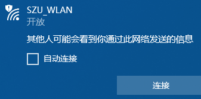
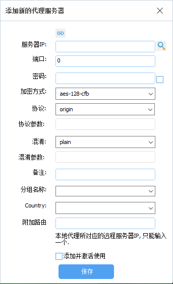
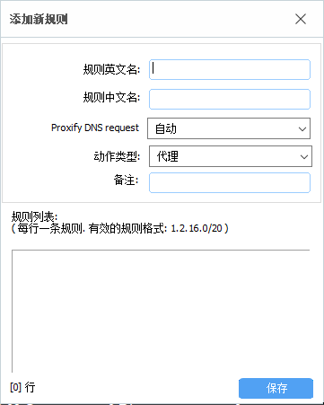
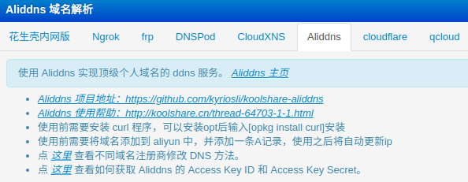

这回来讨论一下某个路由器固件中附带的功能。


呐，就是这货。别误会，我们不会讨论任何科学上网相关的内容，仅仅只是利用这玩意儿来保护自己在校内开放无线网络中的安全。

众所周知，在开放的无线网络中传输的数据可能被他人看到。



可别忘了我们学校的选课系统等诸多服务都没有启用或是没有强制使用HTTPS，这就意味着我们的很多数据（包括某些密码）都是在网络上裸奔的，学校又这么开放，谁知道哪天会不会有人进来开个监听模式抓一波密码呢...不指望着等学校把无线网络改成企业认证了，还是利用一些工具先来保护自己比较好。

关于这个固件的具体详情可以看[这里](https://www.right.com.cn/forum/thread-161324-1-1.html)，应该不需要我再扯了。我之所以用这个...主要是因为集成了很多功能，不需要自己再费劲去装了，当然，你要是想折腾，条条大路通罗马是吧。

## 准备好路由器上的配置
首先，让我们先启动一下这个服务器。


加密方式选择后要记住，之后要连接的时候要填。密码尽量够长够复杂，并且尽量不要与其它密码重复。还有UDP转发。

打开开关，应用本页面设置。应该基本的设置是完成了。

## Windows下连接
假设你正在使用Windows。有个似乎有点年头的软件：SS-Tap，这似乎不是个很好的选择？但是平常用用体验还是可以的。

!!! tip
    最新版本（1.1.0.1）去掉了全局规则，开始专心地做一个游戏加速器了（？），自行添加的全局规则也会被改掉。为了让我们全部的流量都不会暴露在开放的无线公共网络上，所以需要溜到程序的规则目录下把规则改了。当然，你也可以选择旧版，据传版本号为1.0.9.7的程序仍然有全局规则。

假装你已经把它装好了并且没有遇到什么问题。那么让我们来配置一下：


由于我们在路由端启动的是ss，所以，添加一个S/R：



现在学校IP地址的租约竟然是10分钟，希望你在出门前已经事先看好并记住了路由器的IP地址（当然，我这么懒，肯定是不会这样做的，下文会分享我的解tou决lan方法），把它填进**服务器IP**一栏，**端口**、**密码**、**加密方式**和路由器上保持一致即可。

因为我们需要数据在开放的网络中保证安全，所以我们自然更希望这是全局的代理。可惜这软件的最后一个版本没有，我们来创一个：



中英文名字随便起，记住就好。别忘了类型得是**代理**。规则先填上**0.0.0.0/0**。然后保存。

印象中，这个自己写的有点问题的全局的规则会被改写。我们到它所在的地方（应该在个人文件夹下的/AppData/Local/SSTap-beta/rules中）直接改它：


好了，忙活了半天，终于可以开始连接了。正常情况下，如果你已经连接上SZU_WLAN并通过了无线准入认证，点击主界面的连接就可以连上了。这个时候，如果能访问路由器的管理页面，说明配置应该是正确的。

## 利用DDNS来让你不需要再记忆IP地址
其实我一直在想一件事：那些天天在用内网IP远程控制的同学们，每天出门看IP、提心吊胆怕IP变动、实在不行还要开个TeamViewer来看看IP，不是很累吗...

你可能按照上文配置好了服务，但是每天要连接的时候都要改一下软件中的服务器IP。更要命的是，出门要检查的不仅是手机校卡，还得看看今天的IP是啥，要是今天运气不好IP变化了，不回宿舍一趟好像还就都连不上了。别慌，这个固件里有这个东西：



如果你有一个域名，就可以利用这个程序来帮你在IP地址变动时，自动地将域名的某个解析记录更新成新的IP地址。这就意味着，平时只需要记住自己的域名，剩下的就交给DDNS来解决就好了。

这个固件有实现了多个厂商的DDNS的程序。你可以选择一个对应的来用。我正在用Aliddns，首先需要到阿里的控制台上**新增一条解析记录**（先随便指向一个内网地址），然后要有**accesskeys**，这些阿里云的官方文档里都有，应该不用我说了...先把这些信息填进Aliddns保存。

对了，如果你连域名都没有，先去买一个吧。最好是固件里那些脚本支持的，不然可能要折腾半天...

然后，点开下方获取IP的脚本，我们需要修改它。原本的脚本应该是获取了IPv4出口地址，但是这并不是我们目前这个情况下想要的。我们希望它是内网的地址，所以，把它改成从本地获取地址，并过滤一下，就像这样:

从：

``` bash
# 自行测试哪个代码能获取正确的IP，删除前面的#可生效
arIpAddress () {
# IPv4地址获取
# 获得外网地址
#curltest=`which curl`
#if [ -z "$curltest" ] || [ ! -s "`which curl`" ] ; then
    #wget --no-check-certificate --quiet --output-document=- "https://www.ipip.net" | grep "IP地址" | grep -E -o '([0-9]+\.){3}[0-9]+' | head -n1 | cut -d' ' -f1
    #wget --no-check-certificate --quiet --output-document=- "http://members.3322.org/dyndns/getip" | grep -E -o '([0-9]+\.){3}[0-9]+' | head -n1 | cut -d' ' -f1
    #wget --no-check-certificate --quiet --output-document=- "ip.6655.com/ip.aspx" | grep -E -o '([0-9]+\.){3}[0-9]+' | head -n1 | cut -d' ' -f1
    #wget --no-check-certificate --quiet --output-document=- "ip.3322.net" | grep -E -o '([0-9]+\.){3}[0-9]+' | head -n1 | cut -d' ' -f1
#else
    #curl -L -k -s "https://www.ipip.net" | grep "IP地址" | grep -E -o '([0-9]+\.){3}[0-9]+' | head -n1 | cut -d' ' -f1
    #curl -k -s "http://members.3322.org/dyndns/getip" | grep -E -o '([0-9]+\.){3}[0-9]+' | head -n1 | cut -d' ' -f1
    #curl -k -s ip.6655.com/ip.aspx | grep -E -o '([0-9]+\.){3}[0-9]+' | head -n1 | cut -d' ' -f1
    #curl -k -s ip.3322.net | grep -E -o '([0-9]+\.){3}[0-9]+' | head -n1 | cut -d' ' -f1
#fi
}
```

变成：

``` bash
arIpAddress () {
    ifconfig | grep inet | grep -oE '172\.[0-9]{1,3}\.[0-9]{1,3}\.[0-9]{1,3}' | head -n1
}
```

!!! warning
    由于内网网段是172开头的，这样子过滤可以比较省事。当然你要是所处的网络环境不一样的话，这样做是没法得到正确结果的，你可以改一下正则然后到控制台上尝试一下再把可用的命令填到这里。

有点投机取巧的样子，不过你有更好的方法的话可以把它换掉，能顺便告诉我就更好啦。

别忘记了先测试是否可行，比如在**系统管理-控制台**或是SSH上测试好，确认已经能返回正确的内网地址，再把它填进脚本中保存。

这个时候你应该可以启动DDNS了。

正常情况下，你能从**右上方的日志按钮**或是左侧栏的**系统日志**进入并看到有关Aliddns的信息，例如检测到本地IP与DNS解析记录不符，并且正确地更新了域名指向。这应该证明配置是正确的。

应该能在日志里找到类似这样的内容：

    Month Day Hour:Minute:Second 【AliDDNS动态域名】: 开始更新 xxx.xxx.xxx 域名 IP 指向
    Month Day Hour:Minute:Second 【AliDDNS动态域名】: 目前 IP: xxx.xxx.xxx.xxx
    Month Day Hour:Minute:Second 【AliDDNS动态域名】: 上次 IP: 
    Month Day Hour:Minute:Second 【AliDDNS动态域名】: 更新的记录  xxxxxxxxxxxxxxxxx
    Month Day Hour:Minute:Second 【AliDDNS动态域名】: 成功更新： xxx.xxx.xxx.xxx
    Month Day Hour:Minute:Second 【AliDDNS动态域名】: 更新动态DNS记录成功！
    Month Day Hour:Minute:Second 【AliDDNS动态域名】: 守护进程启动

这就大功告成了。

废话一句，你可以利用这个方法来避免远程控制还需要记忆IP，不管你是否在用路由器，道理是差不多的。

## 额外的加成
或许你已经知道教学区域内限制每人出口最高20M下行4M上行，宿舍区域是上下行对等的。一旦使用上述方法，在教学区也能有和在宿舍一样的速度。另外，在某些情况下，机房的外网出口拥挤时，这个方法也能获得正常的网络速度。
