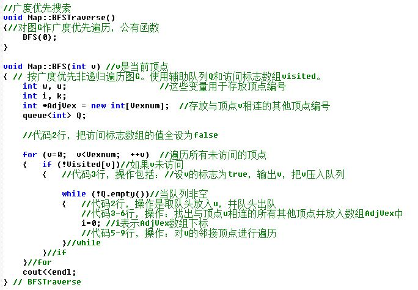

# DS图遍历--广度优先搜索
时间限制: 1 Sec  内存限制: 128 MB

## 题目描述
给出一个图的邻接矩阵，对图进行深度优先搜索，从顶点0开始

注意：图n个顶点编号从0到n-1

代码框架如下：



## 输入
第一行输入t，表示有t个测试实例

第二行输入n，表示第1个图有n个结点

第三行起，每行输入邻接矩阵的一行，以此类推输入n行

第i个结点与其他结点如果相连则为1，无连接则为0，数据之间用空格隔开

以此类推输入下一个示例

## 输出
每行输出一个图的广度优先搜索结果，结点编号之间用空格隔开

## 样例输入
    2
    4
    0 0 1 1
    0 0 1 1
    1 1 0 1
    1 1 1 0
    5
    0 0 0 1 1
    0 0 1 0 0
    0 1 0 1 1
    1 0 1 0 0
    1 0 1 0 0

## 样例输出
    0 2 3 1 
    0 3 4 2 1 

## 提示

## 解决方案
``` cpp
#include <iostream>
#include <vector>
#include <queue>

class Map {
public:
    Map(int size) : size(size), matrix(size, std::vector<int>(size, 0)) {}
    void setMatrixFromCin() {
        for (int ir = 0; ir < matrix.size(); ++ir) {
            for (int ic = 0; ic < matrix.size(); ++ic) {
                std::cin >> matrix[ir][ic];
            }
        }
    }
    void bfs() {
        visited = std::vector<bool>(size, false);
        for (int i = 0; i < visited.size(); ++i) {
            if (visited[i] == false) {
                bfs(i);
            }
        }
        std::cout << std::endl;
    }

private:
    int size;
    std::vector<std::vector<int> > matrix;
    std::vector<bool> visited;
    void bfs(int vertex) {
        std::queue<int> queue;
        for (int i = 0; i < matrix.size(); ++i) {
            if (visited[i] == false) {
                visited[i] = true;
                std::cout << i << ' ';
                queue.push(i);
                while (!queue.empty()) {
                    i = queue.front();
                    queue.pop();
                    for (int id = 0; id < matrix.size(); ++id) {
                        if (matrix[i][id] == 1 && visited[id] == false) {
                            visited[id] = true;
                            std::cout << id << ' ';
                            queue.push(id);
                        }
                    }
                }
            }
        }
    }
};

int main() {
    int ctrl;
    std::cin >> ctrl;

    while (ctrl--) {
        int size;
        std::cin >> size;
        Map map(size);
        map.setMatrixFromCin();
        map.bfs();
    }

    return 0;
}

```
